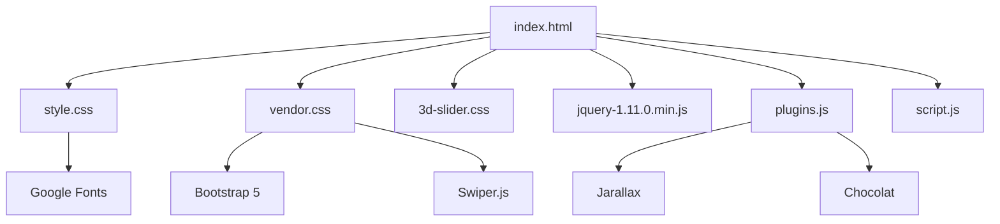

# PikiStyles Technical Documentation

## Table of Contents

1. [Architecture Overview](#architecture-overview)
2. [HTML Structure](#html-structure)
3. [CSS Architecture](#css-architecture)
4. [JavaScript Modules](#javascript-modules)
5. [Component Documentation](#component-documentation)
6. [API Reference](#api-reference)
7. [Deployment Guide](#deployment-guide)

---

## 1. Architecture Overview

### Design Pattern

The PikiStyles template follows a **traditional multi-page application (MPA)** architecture with:
- Server-side rendering (static HTML)
- Progressive enhancement with JavaScript
- Mobile-first responsive design
- Component-based CSS organization

### Technology Stack

```
┌─────────────────────────────────────┐
│          Presentation Layer         │
│  HTML5 + Bootstrap 5 + Custom CSS   │
└─────────────────────────────────────┘
                  ↓
┌─────────────────────────────────────┐
│         Interaction Layer           │
│   jQuery + Swiper.js + Plugins      │
└─────────────────────────────────────┘
                  ↓
┌─────────────────────────────────────┐
│          Asset Layer                │
│   Images + Fonts + Icons (SVG)      │
└─────────────────────────────────────┘
```

### File Dependencies



---

## 2. HTML Structure

### Document Structure

```html
<!DOCTYPE html>
<html lang="en">
<head>
    <!-- Meta Tags -->
    <meta charset="utf-8">
    <meta name="viewport" content="width=device-width, initial-scale=1.0">
    
    <!-- SEO Meta Tags -->
    <title>PikiStyles - Botique Online Store</title>
    <meta name="description" content="...">
    <meta name="keywords" content="...">
    
    <!-- Stylesheets -->
    <link rel="stylesheet" href="css/vendor.css">
    <link rel="stylesheet" href="style.css">
    <link rel="stylesheet" href="css/3d-slider.css">
    
    <!-- Fonts -->
    <link href="https://fonts.googleapis.com/..." rel="stylesheet">
</head>
<body>
    <!-- SVG Sprite -->
    <!-- Preloader -->
    <!-- Search Box -->
    <!-- Modals (Quick View, Cart, Login) -->
    <!-- Header & Navigation -->
    <!-- Main Content Sections -->
    <!-- Footer -->
    <!-- Scripts -->
</body>
</html>
```

### SVG Icon System

Icons are managed using an SVG sprite system:

```html
<svg xmlns="http://www.w3.org/2000/svg" style="display: none;">
    <symbol id="shopping-cart" viewBox="0 0 24 24">
        <!-- SVG path data -->
    </symbol>
    <symbol id="user" viewBox="0 0 24 24">
        <!-- SVG path data -->
    </symbol>
    <!-- More symbols... -->
</svg>

<!-- Usage -->
<svg class="shopping-cart" width="24" height="24">
    <use xlink:href="#shopping-cart"></use>
</svg>
```

**Available Icons:**
- `#shopping-carriage`
- `#quick-view`
- `#shopping-cart`
- `#nav-icon`
- `#close`
- `#plus` / `#minus`
- `#dropdown`
- `#user`
- `#arrow-right`
- `#search`
- Social media icons (facebook, twitter, youtube, instagram, pinterest)

### Modal Components

#### Quick View Modal
```html
<div class="modal fade" id="modaltoggle">
    <div class="modal-dialog">
        <div class="modal-content">
            <!-- Product preview content -->
        </div>
    </div>
</div>
```

#### Shopping Cart Modal
```html
<div class="modal fade" id="modallong">
    <!-- Cart items list -->
    <!-- Subtotal calculation -->
    <!-- Checkout buttons -->
</div>
```

#### Login Modal
```html
<div class="modal fade" id="modallogin">
    <!-- Login form -->
    <!-- Remember me checkbox -->
    <!-- Forgot password link -->
</div>
```

---

## 3. CSS Architecture

### CSS File Organization

```
styles/
├── style.css           (31.5 KB) - Main styles
├── vendor.css          (256 KB)  - Third-party libraries
└── 3d-slider.css       (5.5 KB)  - 3D carousel specific
```

### CSS Custom Properties

#### Color Variables

```css
:root {
    /* Primary Colors */
    --accent-color: #333;
    --black-color: #000;
    --dark-color: #111;
    --light-color: #fff;
    
    /* Brand Colors */
    --bs-primary: #ce071e;
    --bs-primary-dark: #8d0414;
    
    /* Gray Scale */
    --gray-color-100: #F1F1F1;
    --gray-color-200: #E1E1E1;
    --gray-color-300: #D1D1D1;
    --gray-color-400: #ced4da;
    --gray-color-500: #adb5bd;
    --dark-gray-color: #7A7A7A;
}
```

#### Typography Variables

```css
:root {
    --body-font: "Inter", sans-serif;
    --heading-font: "Inter", sans-serif;
    --extra-font: "Playfair Display", sans-serif;
    
    --heading-font-weight: 400;
    --heading-color: var(--bs-dark);
    --heading-line-height: 1.24;
}
```

### Bootstrap 5 Overrides

```css
body {
    --bs-body-font-size: 1rem;
    --bs-body-font-weight: 400;
    --bs-body-line-height: 1.7;
    --bs-body-color: #8f8f8f;
}

/* Responsive Font Size */
@media only screen and (max-width: 991px) {
    body {
        --bs-body-font-size: 1.2rem;
    }
}
```

### Button Styles

#### Button Sizes
- `.btn-small` - Compact buttons
- `.btn-medium` - Standard buttons
- `.btn-large` - Prominent CTAs

#### Button Shapes
- `.btn-rounded` - Rounded corners (6px)
- `.btn-pill` - Fully rounded (2em)

#### Button Colors
- `.btn-black` - Dark background
- `.btn-red` - Primary brand color
- `.btn-outline-dark` - Transparent with dark border
- `.btn-outline-gray` - Transparent with gray border

#### Button Effects
- `.hvr-sweep-to-right` - Animated sweep effect on hover

```css
.hvr-sweep-to-right:before {
    content: "";
    position: absolute;
    background: var(--bs-red);
    transform: scaleX(0);
    transition: transform 0.3s ease-out;
}

.hvr-sweep-to-right:hover:before {
    transform: scaleX(1);
}
```

### Utility Classes

#### Spacing
- `.padding-small` - 2em top/bottom
- `.padding-medium` - 4em top/bottom
- `.padding-large` - 7em top/bottom
- `.margin-small` to `.margin-xlarge` - Various margin sizes

#### Backgrounds
- `.bg-gray` - Light gray background
- `.bg-light` - White background

#### Borders
- `.border-circle` - Circular border radius
- `.border-rounded-10` - 10px border radius
- `.border-top/right/bottom/left` - Individual borders

### 3D Slider Styling

The 3D slider uses CSS transforms and animations:

```css
.slider-3d {
    transform-style: preserve-3d;
    transform: perspective(1000px);
    animation: autoRun 20s linear infinite;
}

@keyframes autoRun {
    from {
        transform: perspective(1000px) rotateX(-16deg) rotateY(0deg);
    }
    to {
        transform: perspective(1000px) rotateX(-16deg) rotateY(360deg);
    }
}

.slider-3d-item {
    transform: 
        rotateY(calc((var(--position) - 1) * (360deg / var(--quantity))))
        translateZ(min(450px, 35vw));
}
```

**Custom Properties:**
- `--quantity` - Total number of slider items
- `--position` - Position index of each item (1-based)

---

## 4. JavaScript Modules

### Main Script (script.js)

#### Initialization Functions

##### 1. Product Quantity Controls

```javascript
var initProductQty = function() {
    $('.product-qty').each(function(){
        var $el_product = $(this);
        
        // Increase quantity
        $el_product.find('.quantity-right-plus').click(function(e){
            e.preventDefault();
            var quantity = parseInt($el_product.find('.quantity').val());
            $el_product.find('.quantity').val(quantity + 1);
        });
        
        // Decrease quantity
        $el_product.find('.quantity-left-minus').click(function(e){
            e.preventDefault();
            var quantity = parseInt($el_product.find('.quantity').val());
            if(quantity > 0){
                $el_product.find('.quantity').val(quantity - 1);
            }
        });
    });
}
```

##### 2. Jarallax Parallax

```javascript
var initJarallax = function() {
    jarallax(document.querySelectorAll(".jarallax"));
    
    jarallax(document.querySelectorAll(".jarallax-img"), {
        keepImg: true,
    });
}
```

##### 3. Chocolat Lightbox

```javascript
var initChocolat = function() {
    Chocolat(document.querySelectorAll('.image-link'), {
        imageSize: 'contain',
        loop: true,
    })
}
```

##### 4. Text Animation Effects

```javascript
var initTextFx = function() {
    $('.txt-fx').each(function() {
        var newstr = '';
        var delay = 0;
        var stagger = 10;
        var words = this.textContent.split(/\s/);
        
        $.each(words, function(key, value) {
            newstr += '<span class="word">';
            for (var i = 0; i < value.length; i++) {
                newstr += "<span class='letter' style='transition-delay:"+ 
                          (delay + stagger * count) +"ms;'>"+ 
                          value[i] +"</span>";
            }
            newstr += '</span>';
            newstr += "<span class='letter' style='transition-delay:"+ 
                      delay +"ms;'>&nbsp;</span>";
        });
        
        this.innerHTML = newstr;
    });
}
```

#### Swiper Slider Configuration

##### Main Swiper (Homepage)

```javascript
var swiper = new Swiper(".main-swiper", {
    slidesPerView: 1,
    spaceBetween: 48,
    pagination: {
        el: ".swiper-pagination",
        clickable: true,
    },
    breakpoints: {
        900: {
            slidesPerView: 2,
            spaceBetween: 48,
        },
    },
});
```

##### Product Thumbnail Slider

```javascript
var thumb_slider = new Swiper(".product-thumbnail-slider", {
    slidesPerView: 5,
    spaceBetween: 10,
    direction: "vertical",
    breakpoints: {
        0: {
            direction: "horizontal"
        },
        992: {
            direction: "vertical"
        },
    },
});
```

##### Product Large Slider

```javascript
var large_slider = new Swiper(".product-large-slider", {
    slidesPerView: 1,
    spaceBetween: 0,
    effect: 'fade',
    thumbs: {
        swiper: thumb_slider,
    },
    pagination: {
        el: ".swiper-pagination",
        clickable: true,
    },
});
```

#### Event Handlers

```javascript
$(document).ready(function() {
    // Initialize all functions
    initProductQty();
    initJarallax();
    initChocolat();
    initTextFx();
    
    // Search box toggle
    $(".user-items .search-item").click(function() {
        $(".search-box").toggleClass('active');
        $(".search-box .search-input").focus();
    });
    
    $(".close-button").click(function() {
        $(".search-box").toggleClass('active');
    });
});

// Preloader fadeout
$(window).load(function(){
    $('.preloader').fadeOut();
});
```

---

## 5. Component Documentation

### Header Component

**Location:** Lines 381-542 in index.html

**Structure:**
```html
<header id="header" class="site-header">
    <nav id="header-nav" class="navbar navbar-expand-lg">
        <!-- Logo -->
        <!-- Mobile Toggle Button -->
        <!-- Offcanvas Menu -->
        <!-- User Actions (Login, Cart, Search) -->
    </nav>
</header>
```

**Key Features:**
- Responsive offcanvas navigation for mobile
- Dropdown menus for categories
- User action icons (login, cart, search)
- Sticky positioning (optional)

### 3D Slider Component

**Location:** Lines 544-573 in index.html

**HTML Structure:**
```html
<section class="slider-3d-section" id="intro">
    <div class="slider-3d" style="--quantity: 6">
        <div class="slider-3d-item" style="--position: 1">
            
        </div>
        <!-- More items -->
    </div>
    <div class="slider-3d-content">
        <div class="slider-3d-author">
            <h2>PikiStyles</h2>
            <p><b>Premium Fashion Collection</b></p>
        </div>
    </div>
</section>
```

**CSS Variables:**
- `--quantity` - Total items in carousel
- `--position` - Item position (1 to quantity)

**Responsive Behavior:**
- Desktop: 200x250px items, 450px translation
- Tablet: 160x200px items, 300px translation
- Mobile: 140x200px items, 350px translation

### Product Card Component

**Structure:**
```html
<div class="col mb-4 mb-3">
    <div class="product-card position-relative">
        <div class="card-img">
            
            <div class="cart-concern position-absolute">
                <div class="cart-button">
                    <!-- Add to Cart Button -->
                    <!-- Quick View Button -->
                </div>
            </div>
        </div>
        <div class="card-detail">
            <h3 class="card-title fs-6 fw-normal">
                <a href="...">Product Name</a>
            </h3>
            <span class="card-price fw-bold">$99</span>
        </div>
    </div>
</div>
```

**Features:**
- Hover-activated action buttons
- Responsive image sizing
- Price display
- Link to product detail

### Footer Component

**Location:** Lines 778-908 in index.html

**Sections:**
- Info links
- About links
- Collection categories
- Popular pages
- Contact information

**Grid Layout:**
```
┌──────┬──────┬──────┬──────┬──────┬──────┐
│ Info │About │Women │Popular│ Men  │Contact│
└──────┴──────┴──────┴──────┴──────┴──────┘
```

---

## 6. API Reference

### jQuery Plugin Methods

#### Product Quantity

```javascript
// Initialize quantity controls
$('.product-qty').productQty();

// Manual increment
$('.quantity').val(parseInt($('.quantity').val()) + 1);

// Manual decrement
var qty = parseInt($('.quantity').val());
if(qty > 0) {
    $('.quantity').val(qty - 1);
}
```

#### Search Box

```javascript
// Toggle search box
$('.search-box').toggleClass('active');

// Focus search input
$('.search-input').focus();
```

### Bootstrap 5 Modal API

```javascript
// Show modal programmatically
var myModal = new bootstrap.Modal(document.getElementById('modaltoggle'));
myModal.show();

// Hide modal
myModal.hide();

// Using data attributes
<button data-bs-toggle="modal" data-bs-target="#modaltoggle">
    Open Modal
</button>
```

### Swiper API

```javascript
// Access swiper instance
var swiper = document.querySelector('.swiper').swiper;

// Navigate
swiper.slideNext();
swiper.slidePrev();
swiper.slideTo(index);

// Update
swiper.update();

// Destroy
swiper.destroy();
```

---

## 7. Deployment Guide

### Pre-Deployment Checklist

- [ ] Optimize all images (compress to web-friendly sizes)
- [ ] Minify CSS and JavaScript files
- [ ] Test on all major browsers
- [ ] Verify all links work correctly
- [ ] Update contact information
- [ ] Add Google Analytics (optional)
- [ ] Set up favicon
- [ ] Configure meta tags for SEO

### Static Hosting Deployment

#### GitHub Pages

```bash
# 1. Push to GitHub repository
git add .
git commit -m "Deploy to GitHub Pages"
git push origin main

# 2. Enable GitHub Pages in repository settings
# Settings > Pages > Source: main branch
```

#### Netlify

```bash
# 1. Create netlify.toml
[build]
  publish = "."

# 2. Deploy via Netlify CLI
npm install -g netlify-cli
netlify deploy --prod
```

#### Vercel

```bash
# Deploy via Vercel CLI
npm install -g vercel
vercel --prod
```

### Performance Optimization

#### Image Optimization

```bash
# Using ImageOptim (Mac) or TinyPNG
# Compress all images to reduce file size by 60-80%

# Recommended tools:
- TinyPNG.com (online)
- ImageOptim (Mac)
- RIOT (Windows)
```

#### CSS Minification

```bash
# Install clean-css
npm install -g clean-css-cli

# Minify CSS
cleancss -o style.min.css style.css
cleancss -o vendor.min.css css/vendor.css
cleancss -o 3d-slider.min.css css/3d-slider.css
```

#### JavaScript Minification

```bash
# Install UglifyJS
npm install -g uglify-js

# Minify JavaScript
uglifyjs js/script.js -o js/script.min.js -c -m
```

### SEO Optimization

#### Meta Tags Template

```html
<meta name="description" content="PikiStyles - Premium fashion boutique offering elegant clothing and footwear collections for men and women in Nairobi, Kenya.">
<meta name="keywords" content="fashion, boutique, clothing, shoes, Kenya, Nairobi, online store">
<meta name="author" content="PikiStyles">
<meta name="robots" content="index, follow">

<!-- Open Graph -->
<meta property="og:title" content="PikiStyles - Premium Fashion Boutique">
<meta property="og:description" content="Discover our exclusive range of clothing & footwear">
<meta property="og:image" content="https://yoursite.com/images/og-image.jpg">
<meta property="og:url" content="https://yoursite.com">
<meta property="og:type" content="website">

<!-- Twitter Card -->
<meta name="twitter:card" content="summary_large_image">
<meta name="twitter:title" content="PikiStyles - Premium Fashion Boutique">
<meta name="twitter:description" content="Discover our exclusive range of clothing & footwear">
<meta name="twitter:image" content="https://yoursite.com/images/twitter-card.jpg">
```

#### Sitemap.xml

```xml
<?xml version="1.0" encoding="UTF-8"?>
<urlset xmlns="http://www.sitemaps.org/schemas/sitemap/0.9">
    <url>
        <loc>https://yoursite.com/</loc>
        <lastmod>2025-01-19</lastmod>
        <changefreq>weekly</changefreq>
        <priority>1.0</priority>
    </url>
    <!-- Add more pages -->
</urlset>
```

#### Robots.txt

```
User-agent: *
Allow: /
Sitemap: https://yoursite.com/sitemap.xml
```

### Analytics Integration

#### Google Analytics 4

```html
<!-- Add before </head> -->
<script async src="https://www.googletagmanager.com/gtag/js?id=G-XXXXXXXXXX"></script>
<script>
  window.dataLayer = window.dataLayer || [];
  function gtag(){dataLayer.push(arguments);}
  gtag('js', new Date());
  gtag('config', 'G-XXXXXXXXXX');
</script>
```

### Security Considerations

#### Content Security Policy

```html
<meta http-equiv="Content-Security-Policy" 
      content="default-src 'self'; 
               script-src 'self' 'unsafe-inline' https://www.googletagmanager.com; 
               style-src 'self' 'unsafe-inline' https://fonts.googleapis.com;
               font-src 'self' https://fonts.gstatic.com;
               img-src 'self' data:;">
```

#### HTTPS Setup

Always serve your site over HTTPS. Most modern hosting providers (Netlify, Vercel, GitHub Pages) provide free SSL certificates.

---

## Maintenance & Updates

### Regular Maintenance Tasks

**Monthly:**
- [ ] Check all links for broken URLs
- [ ] Update product images and descriptions
- [ ] Review and update prices
- [ ] Check browser compatibility

**Quarterly:**
- [ ] Update third-party libraries (Bootstrap, jQuery, Swiper)
- [ ] Review and optimize site performance
- [ ] Analyze user behavior with analytics
- [ ] Update content and add new products

**Annually:**
- [ ] Review and update SEO strategy
- [ ] Conduct security audit
- [ ] Redesign/refresh visual elements
- [ ] Update contact information and policies

---

**Document Version:** 1.0.0  
**Last Updated:** January 2025  
**Maintained by:** PikiStyles Development Team
